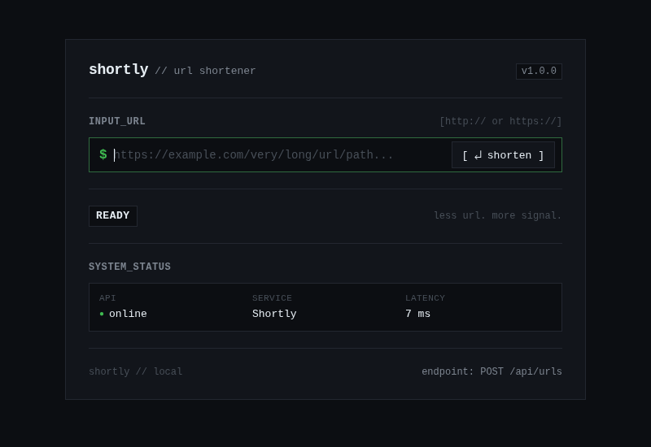

# Shortly

Shortly is a minimal, production-quality URL shortener service built with Node.js, Express, and MongoDB. It features high-speed redirects, robust input validation, rate limiting, security headers, and an understated, Unix-inspired web interface.



## Table of Contents

- [Features](#features)
- [Tech Stack](#tech-stack)
- [Project Structure](#project-structure)
- [Prerequisites](#prerequisites)
- [Getting Started](#getting-started)
  - [1. Clone and Install](#1-clone-and-install)
  - [2. Start MongoDB](#2-start-mongodb)
  - [3. Configure Environment Variables](#3-configure-environment-variables)
  - [4. Run the Application](#4-run-the-application)
- [Web Interface](#web-interface)
- [Available Scripts](#available-scripts)
- [API Reference](#api-reference)
  - [Foundation Endpoints](#foundation-endpoints)
  - [URL Endpoints](#url-endpoints)
- [Security & Validation](#security--validation)
- [License](#license)

---

## Features

- **URL Shortening**: Generates unique, URL-safe 6-character Base62 identifiers with automated collision resolution.
- **Short-Code Generation**: Cryptographically secure random identifiers generated via native `crypto.randomInt`.
- **Fast HTTP 302 Redirects**: Rapid lookups via unique MongoDB indexes with atomic click incrementing.
- **Robust Input Validation**: Strict validation for absolute HTTP/HTTPS protocols and short-code format sanitization.
- **Rate Limiting**: Built-in rolling-window limiter restricting URL creation to 30 requests per minute per IP.
- **Security Headers**: Hardened with Helmet (Content Security Policy, X-Frame-Options, X-Content-Type-Options nosniff).
- **Unix-Inspired Web Interface**: Minimalist, keyboard-first developer interface with zero frontend framework overhead.
- **Graceful Lifecycle Management**: Sequential DB-first startup and graceful shutdown hooks for SIGINT/SIGTERM.
- **Health & Telemetry**: `/health` endpoint reporting uptime, service metadata, and client-measured roundtrip latency.

## Tech Stack

- **Runtime**: Node.js (JavaScript, CommonJS)
- **Framework**: Express v5
- **Database / ODM**: MongoDB with Mongoose v9
- **Security & Headers**: Helmet
- **Configuration**: dotenv
- **Development Tooling**: nodemon
- **Frontend**: Vanilla HTML5, CSS3 (monospace design system), Vanilla JavaScript (fetch API)

## Project Structure

```text
.
├── docs/
│   └── images/
│       └── shortly-ui.png   # Web interface preview
├── src/
│   ├── config/
│   │   └── db.js            # MongoDB connection and lifecycle handlers
│   ├── controllers/
│   │   └── urlController.js # Request handlers (validation, response shaping)
│   ├── middlewares/
│   │   └── rateLimiter.js   # Rolling-window in-memory rate limiter
│   ├── models/
│   │   └── Url.js           # Mongoose model, schema validation, and unique indexes
│   ├── public/
│   │   ├── app.js           # Frontend client application
│   │   ├── index.html       # Minimalist Unix-style markup
│   │   └── styles.css       # Monospace stylesheet
│   ├── routes/
│   │   ├── redirectRoutes.js# GET /:shortCode redirect router
│   │   └── urlRoutes.js     # POST /api/urls router
│   ├── services/
│   │   └── urlService.js    # Shortening business logic, collision retries, DB access
│   ├── utils/
│   │   └── generateShortCode.js # Cryptographic Base62 short-code generator
│   ├── app.js               # Express application assembly & error middleware
│   └── server.js            # Server entrypoint and graceful shutdown listeners
├── .env.example             # Example environment variable configuration
├── .gitignore               # Git ignore rules (dependencies, secrets, logs)
├── package.json             # NPM package manifest and scripts
├── package-lock.json        # NPM dependency lockfile
└── README.md                # Project documentation
```

## Prerequisites

- [Node.js](https://nodejs.org/) (v18 or higher recommended)
- [npm](https://www.npmjs.com/) (v9 or higher)
- [MongoDB](https://www.mongodb.com/) (v6 or higher; local instance or MongoDB Atlas)

## Getting Started

### 1. Clone and Install

```bash
git clone https://github.com/bluespecks/urlShortner.git
cd urlShortner
npm install
```

### 2. Start MongoDB

Before starting the server, ensure MongoDB is running:

**Linux (Systemd):**
```bash
sudo systemctl start mongod
sudo systemctl status mongod
```

**Manual / Standalone:**
```bash
mkdir -p /tmp/mongodb/data
mongod --dbpath /tmp/mongodb/data --port 27017
```

**macOS (Homebrew):**
```bash
brew services start mongodb-community
```

### 3. Configure Environment Variables

Copy `.env.example` to create your local `.env`:

```bash
cp .env.example .env
```

Update `.env` with your settings:

```env
PORT=3000
MONGODB_URI=mongodb://127.0.0.1:27017/shortly
BASE_URL=http://localhost:3000
```

### 4. Run the Application

#### Development Mode (with hot-reload via nodemon):
```bash
npm run dev
```

#### Production Mode:
```bash
npm start
```

## Web Interface

Shortly includes a minimalist, Unix-inspired web interface:

- Start the application and navigate to `http://localhost:3000` in any web browser.
- Enter any valid HTTP or HTTPS URL and press `Enter` or click `[ ↵ shorten ]`.
- Copy the resulting short link with `[ copy ]` (provides visual `> copied` feedback) or test it directly with `[ open ↗ ]`.
- Live latency and API connectivity are continuously checked via `/health`.

## Available Scripts

| Script | Command | Description |
|---|---|---|
| `npm run dev` | `nodemon src/server.js` | Starts server in watch mode with automatic restart on file changes |
| `npm start` | `node src/server.js` | Starts server in standard production mode |

## API Reference

### Foundation Endpoints

- **`GET /`**
  - Web browser requests (`Accept: text/html`): Delivers the web interface.
  - API client requests (`Accept: application/json` or curl): Returns service metadata.

  **API Response (HTTP 200):**
  ```json
  {
    "name": "Shortly API",
    "version": "1.0.0",
    "description": "Production-quality URL shortener service"
  }
  ```

- **`GET /health`**
  Health check endpoint reporting service availability.

  **Response (HTTP 200):**
  ```json
  {
    "status": "ok",
    "service": "Shortly",
    "timestamp": "2026-09-06T00:00:00.000Z"
  }
  ```

### URL Endpoints

- **`POST /api/urls`**
  Creates a shortened URL. Rate-limited to 30 requests per minute per IP.

  **Headers:**
  - `Content-Type: application/json`

  **Request Body:**
  ```json
  {
    "originalUrl": "https://example.com/some/long/path?query=param"
  }
  ```

  **Response (HTTP 201 Created):**
  ```json
  {
    "originalUrl": "https://example.com/some/long/path?query=param",
    "shortCode": "abc123",
    "shortUrl": "http://localhost:3000/abc123"
  }
  ```

- **`GET /:shortCode`**
  Redirects to the stored original URL.

  **Response:**
  - `HTTP 302 Found` with `Location: <originalUrl>` on success
  - `HTTP 404 Not Found` JSON if shortCode is non-existent:
    ```json
    {
      "error": "NotFound",
      "message": "Short URL not found"
    }
    ```
  - `HTTP 400 Bad Request` JSON if shortCode format is invalid:
    ```json
    {
      "error": "BadRequest",
      "message": "Invalid short code format"
    }
    ```

## Security & Validation

- **URL Protocol Validation**: Strictly accepts only absolute URLs starting with `http://` or `https://`. Rejects `ftp://`, `javascript:`, `data:`, relative paths, or non-string inputs.
- **Short-Code Sanitization**: Format regex (`/^[a-zA-Z0-9_-]{3,30}$/`) ensures malicious path traversals or database operator injections are rejected with HTTP 400 before reaching MongoDB.
- **Security Headers**: Integrated Helmet middleware setting CSP, `nosniff`, `SAMEORIGIN`, and strict transport rules.
- **Rate Limiting**: Rolling-window limiter returns HTTP 429 with `Retry-After` and `RateLimit-*` headers without restricting redirects or health probes.
- **Sanitized Errors**: Internal server errors return clean 500 JSON without exposing stack traces or database connection strings.

## License
 
This project is licensed under the [ISC License](package.json).
